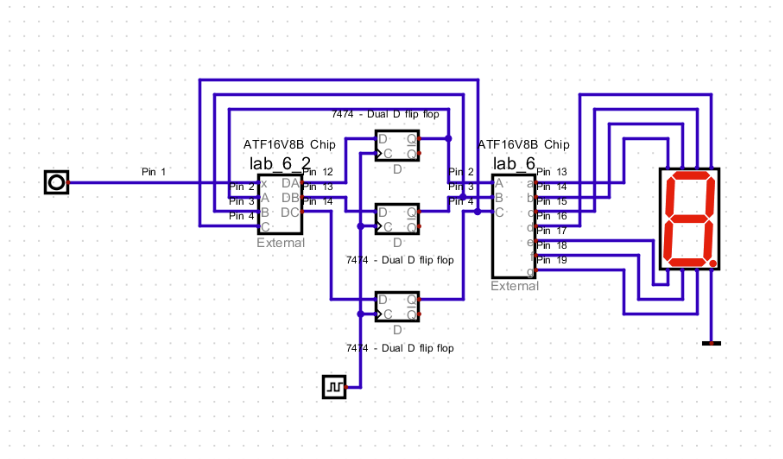

# Moore State Machine Seven-Segment Display

This project is a Moore state machine I built for my CPEN 3700 Digital Design class at UTC. The goal was to create a circuit that could cycle through **"BINARY"** and **"2BRAINS"** on a seven-segment display and switch between the two sequences using an input.

I designed the state transitions, worked out the Boolean logic using Karnaugh maps, and implemented the design using D flip-flops and ATF16V8B PLD chips. I also wrote the logic in both Verilog and CUPL and tested the full circuit in a digital logic simulator.

## Circuit Diagram

Below is the completed state machine in the Digital simulator. The circuit uses three D flip-flops to store the current state, PLDs for the next-state and seven-segment logic, and an input `x` to control the sequence.

## How It Works

The state machine uses three D flip-flops, represented by `A`, `B`, and `C`, to keep track of the current state.

The input `x` controls how the circuit moves between the **BINARY** and **2BRAINS** sequences. The next-state logic determines the values of `DA`, `DB`, and `DC`, which become the next values stored by the flip-flops after the next clock cycle.

A second section of combinational logic takes the current state and determines which outputs `a-g` need to be active on the seven-segment display to show the correct character.

## Design Process

I started by creating a state diagram and figuring out how the circuit needed to transition between each character. I then created Karnaugh maps to simplify the next-state and seven-segment display logic.

I chose to use D flip-flops because they made the implementation more straightforward and required fewer Karnaugh maps than using JK flip-flops.

After simplifying the Boolean equations, I implemented the logic using ATF16V8B programmable logic devices.

## Verilog and CUPL

I wrote the logic in both Verilog and CUPL.

The Verilog files contain the next-state and seven-segment display logic:

- `state_machine.v`
- `seven_segment.v`

The CUPL files contain the Boolean equations and pin assignments used for the ATF16V8B PLDs:

- `state_machine.pld`
- `seven_segment.pld`

GitHub may display the `.pld` files as plain text because CUPL is not normally recognized as a GitHub language, but these are the original CUPL implementations from the project.

## Debugging

One issue I ran into was that the state transitions looked correct in the simulator, but the seven-segment display was not updating correctly.

After troubleshooting the circuit, I realized that my clock was not configured correctly. Once I fixed the clock configuration, the circuit was able to transition from state to state and drive the display correctly.

This was a good example of how the logic itself can be correct while another part of a sequential circuit still prevents the system from working as expected.
